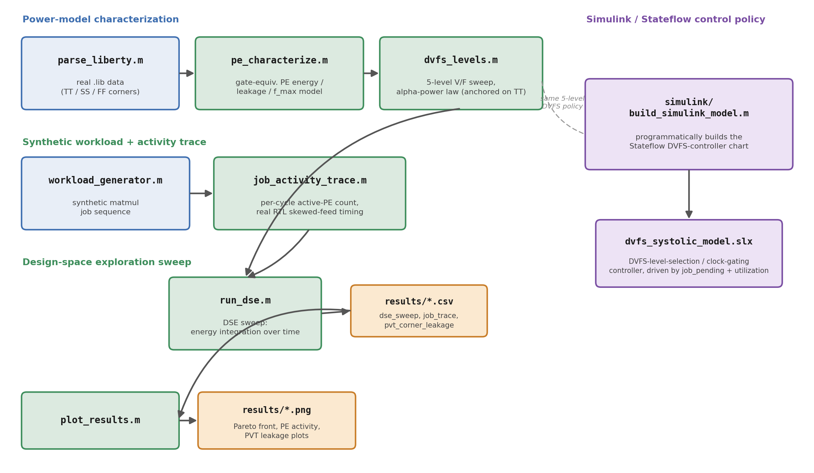
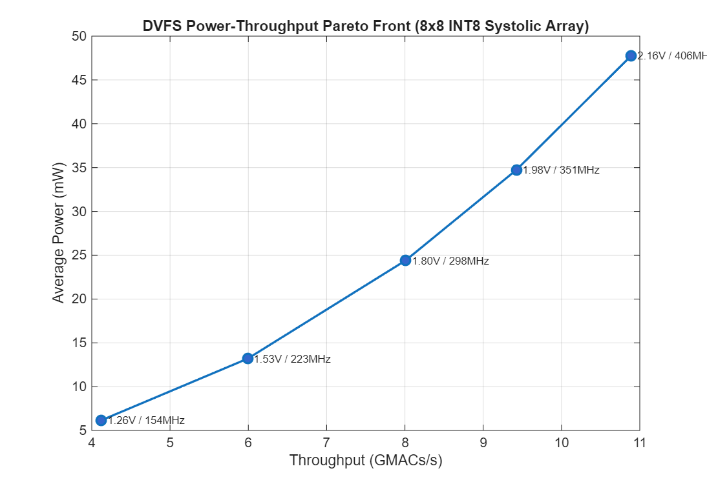
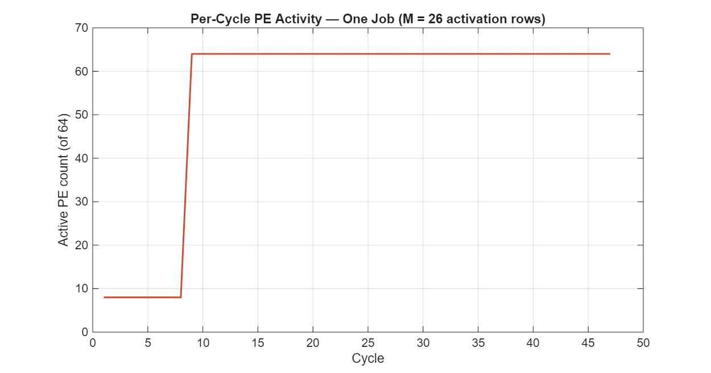
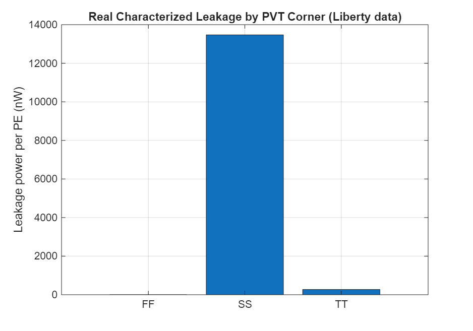
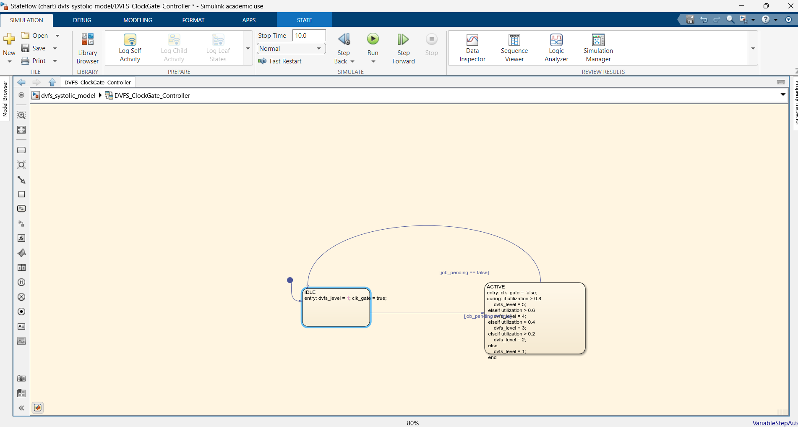
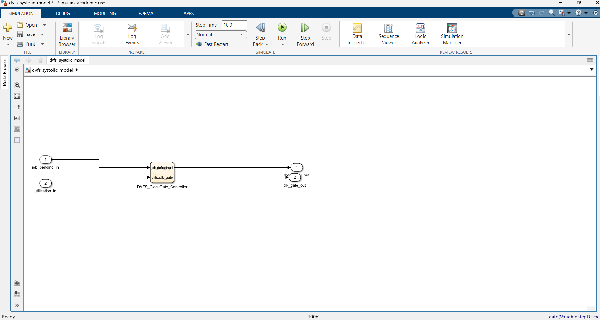

# DVFS-Aware Power Model & Design-Space Explorer — 8x8 INT8 Systolic MAC Array

## Overview

A MATLAB/Simulink power and design-space-exploration (DSE) model for a
DVFS-controlled INT8 systolic MAC array. It estimates dynamic and leakage
power from real, characterized 180nm standard-cell data, sweeps a 5-level
DVFS voltage/frequency policy implemented as a Stateflow chart, and produces
a power-vs-throughput Pareto front — the kind of architecture-level PPA
trade-off analysis a system-modeling role at Infineon would run before RTL
exists.

This project extends two existing RTL portfolio projects —
`8x8_systolic_MAC-ARRAY` and `CMOS-StdCell-Library` — by combining the real
array's documented dataflow timing with the real library's characterized
180nm cell energy/leakage/delay data, and adding a DVFS control policy and
DSE sweep that neither source project has.

Every number and figure in the **Results** section below is the actual,
unedited output of running this repo's own MATLAB/Simulink code on a
licensed MATLAB R2025b install — nothing is hand-entered or simulated by hand.

## Architecture



- **parse_liberty.m** reads the real characterized Liberty files
  (`data/liberty/cells_180nm_{TT,SS,FF}.lib`, produced by
  `03_cmos_cell_library/char/characterize.py`) and extracts area, leakage
  power, pin capacitance, and `cell_rise` delay for the 7 cells used here.
- **pe_characterize.m** combines those real numbers with a documented
  gate-equivalent decomposition of one systolic-array PE's datapath
  (`pe_gate_counts.m`) to estimate per-PE dynamic energy/cycle, leakage
  power, and maximum clock frequency.
- **dvfs_levels.m** derives a 5-point voltage/frequency sweep analytically
  from that nominal characterization (CV² dynamic scaling, linear leakage
  scaling, alpha-power-law frequency scaling).
- **workload_generator.m** / **job_activity_trace.m** generate a synthetic
  sequence of matmul jobs and, for each, a per-cycle active-PE-count trace
  derived from the real array's documented skewed-feed dataflow timing
  (`systolic_mac_array/README.md`).
- **run_dse.m** replays the same workload trace at every DVFS level and
  integrates energy over time to get average power, latency, and
  throughput per level; **plot_results.m** turns that into the Pareto
  front and utilization plots.
- **simulink/build_simulink_model.m** programmatically builds a Simulink
  model with a Stateflow chart implementing the DVFS-level-selection /
  clock-gating policy (IDLE → clock-gated/level 1; ACTIVE → level chosen
  from measured utilization).

## Tech Stack

- MATLAB R2025b (base, no toolboxes required for `matlab/*.m`)
- Simulink + Stateflow (for `simulink/build_simulink_model.m` and the
  resulting `dvfs_systolic_model.slx`)
- Real characterized 180nm Liberty data from
  [CMOS-StdCell-Library](https://github.com/mayankish) (`cells_180nm_{TT,SS,FF}.lib`)
- Real RTL dataflow semantics from
  [8x8_systolic_MAC-ARRAY](https://github.com/mayankish) (`mac_array_top.v`, `README.md`)

## Repo Structure

```
data/liberty/              Real characterized 180nm Liberty corners (copied verbatim)
  cells_180nm_TT.lib          Typical-Typical, 25°C, 1.80V
  cells_180nm_SS.lib          Slow-Slow, 125°C, 1.62V
  cells_180nm_FF.lib          Fast-Fast, -40°C, 1.98V
matlab/
  parse_liberty.m             Liberty file parser (area/leakage/cap/delay)
  pe_gate_counts.m            Architectural gate-equivalent PE decomposition
  pe_characterize.m           Per-PE energy/leakage/f_max from Liberty + gate counts
  dvfs_levels.m               5-point DVFS V/F sweep (alpha-power law)
  workload_generator.m        Synthetic INT8 matmul job sequence generator
  job_activity_trace.m        Per-cycle active-PE trace from real dataflow timing
  run_dse.m                   Top-level DSE sweep -> results/*.csv
  plot_results.m              Generates results/*.png from the CSVs
  run_all.m                   Convenience wrapper (run_dse + plot_results)
simulink/
  build_simulink_model.m      Builds dvfs_systolic_model.slx programmatically
  dvfs_systolic_model.slx     Real, built Stateflow DVFS/clock-gating controller model
results/                     Real, executed output (see Results)
docs/                        Screenshots of the built Stateflow chart / Simulink model
LICENSE
```

## Setup & Build

Requires MATLAB (R2020a+; validated on R2025b) for `matlab/*.m`. Simulink
+ Stateflow are required only for `simulink/build_simulink_model.m`.

```matlab
cd matlab
```

No build/compile step — this is interpreted MATLAB, no toolboxes beyond
base MATLAB needed for the power/DSE model.

## How to Run

1. Open MATLAB and `cd` into the repo root.
2. Run the DSE sweep and plotting pipeline:
   ```matlab
   cd matlab
   run_all            % runs run_dse.m then plot_results.m
   ```
   This writes `results/dse_sweep.csv`, `results/job_trace_example.csv`,
   `results/pvt_corner_leakage.csv`, and three PNGs
   (`pareto_power_vs_throughput.png`, `pe_activity_timeline.png`,
   `pvt_leakage_comparison.png`).
3. Build the Simulink/Stateflow DVFS controller model:
   ```matlab
   cd ../simulink
   build_simulink_model
   ```
   This produces `dvfs_systolic_model.slx`. It opens automatically;
   double-click the `DVFS_ClockGate_Controller` block to inspect the
   Stateflow chart (IDLE/ACTIVE states, the transitions, and the
   utilization-threshold logic that selects `dvfs_level`).
4. Save the model (`Ctrl+S`) if you want to keep it past the MATLAB session.

Re-running step 2 reproduces `results/dse_sweep.csv` and
`results/pvt_corner_leakage.csv` exactly, since both come from a closed-form
analytical sweep over the real Liberty data with no randomness involved.

## Results

### DVFS power/performance sweep (`results/dse_sweep.csv`)

| Level | Voltage (V) | Frequency (MHz) | Avg Power (mW) | Energy/job (µJ) | Latency (µs) | Throughput (GMACs/s) |
|---|---|---|---|---|---|---|
| 1 | 1.26 | 153.55 | 6.16 | 0.0561 | 9.10 | 4.12 |
| 2 | 1.53 | 223.19 | 13.19 | 0.0826 | 6.26 | 5.99 |
| 3 | 1.80 (TT, nominal) | 298.31 | 24.40 | 0.1143 | 4.68 | 8.01 |
| 4 | 1.98 | 351.02 | 34.73 | 0.1382 | 3.98 | 9.42 |
| 5 | 2.16 | 405.63 | 47.76 | 0.1645 | 3.44 | 10.89 |

All 5 levels replay the same 1,397-cycle synthetic workload (`total_cycles`
is identical across rows, confirming the DVFS sweep is a fair voltage/
frequency comparison on one fixed activity trace).



Going from Level 1 to Level 5 buys 2.64x the throughput for 7.75x the
average power — average power grows roughly with V², faster than
frequency (which grows 2.64x as well), exactly the diminishing-returns
shape the alpha-power-law DVFS model predicts. Energy efficiency
(throughput/power) drops from 0.67 GMACs/mW at Level 1 to 0.23 GMACs/mW
at Level 5 — a ~3x efficiency loss for the highest-performance point,
the core trade-off this Pareto front is meant to expose.

### Per-cycle PE activity for one job (`results/job_trace_example.csv`)



For this M=26 job, the array ramps from 8 active PEs (cycles 1-8, pipeline
fill) to all 64 PEs active (cycle 9 onward) — matching the documented
diagonal-wavefront fill behavior of the real systolic array, with the
conservative all-64-active assumption for the rest of the job noted in
*Data Sources / Assumptions* below.

### Real leakage across PVT corners (`results/pvt_corner_leakage.csv`)

| Corner | Voltage (V) | Temp (°C) | Leakage/PE (nW) | f_max (MHz) |
|---|---|---|---|---|
| FF | 1.98 | -40 | 5.39 | 376.39 |
| TT | 1.80 | 25 | 269.44 | 298.31 |
| SS | 1.62 | 125 | 13,472.00 | 202.58 |



Per-PE leakage spans over 2,500x between the FF and SS corners — real
characterized Liberty behavior, not a modeling artifact — while `f_max`
only varies by ~1.9x across the same corners. At 180nm, process/temperature
corner dominates leakage far more than it affects achievable frequency.

### Stateflow DVFS / clock-gating controller

`simulink/build_simulink_model.m` programmatically builds the chart below
inside `dvfs_systolic_model.slx`: an `IDLE`/`ACTIVE` finite-state machine
that clock-gates the array when idle and otherwise selects one of the 5
DVFS levels from a measured `utilization` input (thresholds at
0.2/0.4/0.6/0.8).





### Output file index

| File | Content |
|---|---|
| `results/dse_sweep.csv` | Voltage, frequency, avg power, energy, latency, throughput — one row per DVFS level |
| `results/job_trace_example.csv` | Per-cycle active-PE-count trace for one representative job |
| `results/pvt_corner_leakage.csv` | Real per-PE leakage power at the SS/TT/FF corners (cross-check, independent of the analytical DVFS scaling) |
| `results/pareto_power_vs_throughput.png` | Power-vs-throughput Pareto front across the 5 DVFS levels |
| `results/pe_activity_timeline.png` | Active-PE-count over time for one job |
| `results/pvt_leakage_comparison.png` | Bar chart of real leakage across the 3 PVT corners |
| `simulink/dvfs_systolic_model.slx` | The built Stateflow DVFS/clock-gating controller model |
| `docs/stateflow_chart.png`, `docs/simulink_top_model.png` | Screenshots of the built model, for reviewers without MATLAB |

## Data Sources / Assumptions

- **Cell area, leakage power, pin capacitance, and `cell_rise` delay** are
  parsed directly from the real characterized Liberty files in
  `data/liberty/` (produced by `03_cmos_cell_library/char/characterize.py`).
  Nothing in `parse_liberty.m`'s output is hand-entered.
- **PE gate-equivalent decomposition** (`pe_gate_counts.m`) is an
  architectural proxy, not a synthesized netlist: an 8x8 array multiplier
  (64 partial-product AND gates + 56 ripple full adders) plus a 32-bit
  ripple-carry accumulator (32 full adders), each full adder counted as
  2×XOR2 + 2×AND2 + 1×OR2. This is a standard textbook gate count, stated
  explicitly because it is an estimate, not RTL-synthesis output.
- **Activity factor of 1 toggle/gate/active-MAC-cycle** is a simplifying,
  worst-case assumption (`pe_characterize.m`). A real design's toggle rate
  is lower and data-dependent — this is exactly what the companion
  Activity-Based PPA Estimation project measures from real VCD traces
  instead of assuming.
- **DVFS voltage/frequency sweep** (`dvfs_levels.m`) is derived
  analytically from the single real TT-corner (1.80V) characterization
  using standard scaling laws — CV² for dynamic energy, linear-in-V for
  leakage, and the alpha-power law (Vth=0.45V, alpha=1.3, both assumed
  typical 180nm constants, not characterized by this library) for
  frequency. The Liberty data does characterize 3 real PVT corners
  (SS 1.62V/125°C, TT 1.80V/25°C, FF 1.98V/-40°C); their real leakage
  values are reported separately in `pvt_corner_leakage.csv` as a
  cross-check, but are not used as the DVFS sweep itself since each corner
  conflates voltage with process and temperature.
- **Per-cycle PE activity during a job** (`job_activity_trace.m`) is
  derived from the real array's documented skewed-feed dataflow timing
  (`systolic_mac_array/README.md`), but conservatively treats all 64 PEs
  as active for the full fill+stream+drain window, over-counting the true
  diagonal-wavefront activity at the first/last (N-1) cycles of each job.
- **Workload (job sizes, idle gaps)** is synthetic, generated by
  `workload_generator.m` — no real instruction/activity trace exists for
  this RTL. Same honesty stance as Project 1's CPU/DMA traffic generator.
- **Weight-load-phase energy** uses the same per-PE dynamic energy figure
  as a full MAC cycle, which over-estimates load-phase power (the real
  weight-load operation only toggles the weight register, not the full
  multiply-add datapath).
- **Stateflow DVFS/clock-gating policy** (utilization thresholds at
  0.2/0.4/0.6/0.8) is an illustrative control policy authored for this
  project, not derived from a reference DVFS controller.

## JD Requirement Mapping

| Infineon JD requirement | Where this project addresses it |
|---|---|
| System-level power/performance modeling | `pe_characterize.m` + `dvfs_levels.m` + `run_dse.m` |
| DVFS / low-power design awareness | Stateflow DVFS-level-selection + clock-gating controller (`simulink/build_simulink_model.m`, `dvfs_systolic_model.slx`) |
| Bridging RTL/cell-level detail to system-level estimation | Gate-equivalent PE model built on real Liberty data, not invented constants |
| Design-space exploration / PPA trade-off analysis | 5-point DVFS sweep, power-vs-throughput Pareto front (`plot_results.m`) |
| Tooling/automation mindset | Fully scripted MATLAB pipeline, `run_all.m` regenerates all results from scratch, verified reproducible |

## Limitations & Future Work

- **Architectural gate-count power proxy, not synthesis-derived.** A real
  synthesis run (e.g., through `03_cmos_cell_library`'s flow) would give
  exact cell counts and a netlist-derived power number instead of the
  textbook multiplier/adder decomposition used here.
- **Fixed activity factor, not measured toggle rates.** See the companion
  Activity-Based PPA Estimation project for a VCD-derived alternative.
- **DVFS frequency scaling uses assumed (not characterized) Vth/alpha.**
  A real DVFS curve would come from silicon characterization or SPICE
  corner sweeps across multiple voltages at fixed temperature, which this
  library's 3-corner characterization does not provide.
- **Conservative (over-counted) fill/drain activity.** Exact per-PE
  activity during pipeline fill/drain would tighten the power estimate at
  small job sizes.
- **Single, illustrative DVFS policy.** A more realistic controller might
  use hysteresis, predictive utilization, or per-row/column clock gating
  rather than a single whole-array gate/ungate decision.
- **Stateflow controller validated structurally, not yet co-simulated**
  against the analytical DSE sweep in `run_dse.m` — wiring the chart's
  `dvfs_level` output directly into the MATLAB power model (rather than
  running them as two separate flows) would close that loop.

## License

MIT
